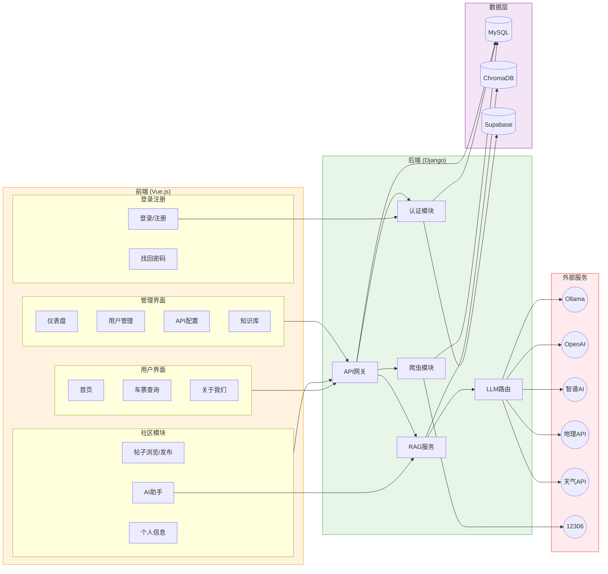

# 旅游网站项目架构流程图

## 架构说明

### 前端层 (Vue.js) 🟠
| 模块 | 功能 |
|------|------|
| 用户界面 | 首页、车票查询、关于我们 |
| 社区模块 | 帖子浏览/发布、AI助手、个人信息 |
| 登录注册 | 登录/注册、找回密码 |
| 管理界面 | 仪表盘、用户管理、API配置、知识库 |

### 后端层 (Django) 🟢
| 模块 | 功能 |
|------|------|
| API网关 | 路由分发 |
| 认证模块 | 用户认证 |
| RAG服务 | 检索增强生成 |
| LLM路由 | 多模型路由选择 |
| 爬虫模块 | 数据爬取 |

### 数据层 🟣
| 存储 | 用途 |
|------|------|
| MySQL | 业务数据存储 |
| ChromaDB | 向量数据库（RAG） |
| Supabase | 认证服务 + 文件存储 |

### 外部服务 🔴
| 类型 | 提供商 |
|------|--------|
| LLM | Ollama(本地)、OpenAI、智谱AI |
| 信息API | 地理API、天气API |
| 数据源 | 12306火车票 |
