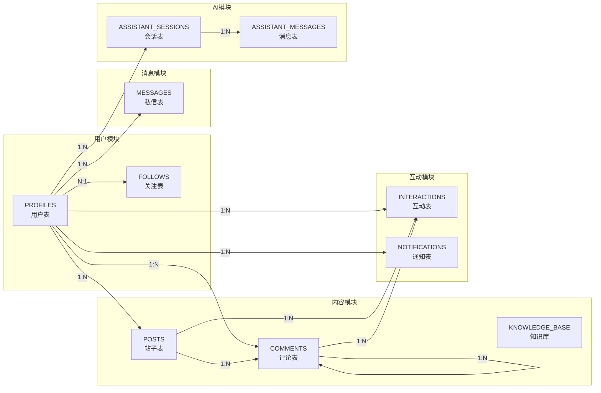

# 智慧旅游综合服务系统 E-R图

## 一、数据库实体概述

本系统基于Supabase（PostgreSQL）构建，共设计了12个核心数据实体，涵盖用户管理、内容发布、社交互动、AI会话及系统运维等功能模块。

## 二、E-R图（Entity-Relationship Diagram）

```mermaid
erDiagram
    PROFILES ||--o{ POSTS : "发布"
    PROFILES ||--o{ COMMENTS : "发表"
    POSTS ||--o{ COMMENTS : "拥有"
    COMMENTS ||--o{ COMMENTS : "回复"
    PROFILES ||--o{ INTERACTIONS : "产生"
    POSTS ||--o{ INTERACTIONS : "被互动"
    COMMENTS ||--o{ INTERACTIONS : "被互动"
    PROFILES ||--o{ NOTIFICATIONS : "接收"
    PROFILES ||--o{ MESSAGES_SENT : "发送"
    PROFILES ||--o{ MESSAGES_RECEIVED : "接收"
    PROFILES ||--o{ FOLLOWS_FOLLOWER : "关注"
    PROFILES ||--o{ FOLLOWS_FOLLOWING : "被关注"
    PROFILES ||--o{ ASSISTANT_SESSIONS : "创建"
    ASSISTANT_SESSIONS ||--o{ ASSISTANT_MESSAGES : "包含"
    PROFILES ||--o{ ADMIN_LOGS : "产生"
    KNOWLEDGE_BASE ||--|| API_PROVIDERS : "使用"

    PROFILES {
        uuid id PK
        text username UK
        text avatar_url
        text bio
        text role
        timestamp with time zone updated_at
    }

    POSTS {
        bigint id PK
        uuid user_id FK
        text title
        text content
        text type
        text[] media_urls
        timestamp with time zone created_at
    }

    COMMENTS {
        bigint id PK
        bigint post_id FK
        uuid user_id FK
        bigint parent_id FK "自关联-嵌套回复"
        text content
        boolean is_deleted
        timestamp with time zone created_at
    }

    INTERACTIONS {
        bigint id PK
        uuid user_id FK
        bigint post_id FK "可为空"
        bigint comment_id FK "可为空"
        text type "like/collect/share/view"
        timestamp with time zone created_at
    }

    NOTIFICATIONS {
        bigint id PK
        uuid user_id FK
        text type "like/collect/comment/follow"
        bigint source_id
        boolean is_read
        timestamp with time zone created_at
    }

    MESSAGES {
        bigint id PK
        uuid sender_id FK
        uuid receiver_id FK
        text content
        text media_url
        text type "text/image/video"
        boolean is_read
        timestamp with time zone created_at
    }

    FOLLOWS {
        bigint id PK
        uuid follower_id FK
        uuid following_id FK
        timestamp with time zone created_at
    }

    ASSISTANT_SESSIONS {
        uuid id PK
        uuid user_id FK
        text title
        timestamp with time zone updated_at
        timestamp with time zone created_at
    }

    ASSISTANT_MESSAGES {
        bigint id PK
        uuid session_id FK
        text role "user/assistant"
        text content
        text image_url
        timestamp with time zone created_at
    }

    KNOWLEDGE_BASE {
        bigint id PK
        text content
        jsonb metadata
        vector(1024) embedding
        timestamp with time zone created_at
    }

    API_PROVIDERS {
        bigint id PK
        text name
        text api_type
        jsonb config
        boolean is_active
        timestamp with time zone created_at
    }

    ADMIN_LOGS {
        bigint id PK
        uuid admin_id FK
        text action
        jsonb details
        timestamp with time zone created_at
    }
```

## 三、实体关系说明

### 3.1 核心实体关系

| 关系名称 | 实体1 | 实体2 | 关系类型 | 说明 |
|----------|-------|-------|----------|------|
| 发布关系 | PROFILES | POSTS | 1:N | 一个用户可发布多篇帖子 |
| 评论关系 | PROFILES | COMMENTS | 1:N | 一个用户可发表多条评论 |
| 所属关系 | POSTS | COMMENTS | 1:N | 一篇帖子可有多条评论 |
| 回复关系 | COMMENTS | COMMENTS | 1:N | 评论可嵌套回复（自关联） |
| 互动关系 | PROFILES | INTERACTIONS | 1:N | 一个用户可产生多个互动 |
| 被互动关系 | POSTS | INTERACTIONS | 1:N | 一个帖子可被多个用户互动 |
| 接收通知 | PROFILES | NOTIFICATIONS | 1:N | 一个用户可接收多条通知 |
| 发送消息 | PROFILES | MESSAGES | 1:N | 一个用户可发送多条消息 |
| 接收消息 | PROFILES | MESSAGES | 1:N | 一个用户可接收多条消息 |
| 关注关系 | PROFILES | FOLLOWS | 1:N | 关注关系（双向N:N通过follows实现） |
| AI会话 | PROFILES | ASSISTANT_SESSIONS | 1:N | 一个用户可有多个AI会话 |
| 会话消息 | ASSISTANT_SESSIONS | ASSISTANT_MESSAGES | 1:N | 一个会话可含多条消息 |

### 3.2 特殊设计说明

#### 3.2.1 评论嵌套回复设计

评论表（COMMENTS）通过 `parent_id` 字段实现自关联，形成树形结构：

```
帖子A
├── 评论1（用户X）
│   ├── 回复1.1（用户Y回复用户X）
│   └── 回复1.2（用户Z回复用户X）
└── 评论2（用户W）
    └── 回复2.1（用户X回复用户W）
```

#### 3.2.2 互动表多态设计

互动表（INTERACTIONS）通过 `post_id` 和 `comment_id` 两个外键实现多态关联：

- 当 `post_id` 有值时，表示对帖子的互动（点赞/收藏）
- 当 `comment_id` 有值时，表示对评论的点赞
- 通过 `type` 字段区分互动类型（like/collect/share/view）

#### 3.2.3 RAG知识库设计

知识库表（KNOWLEDGE_BASE）专为RAG架构设计：

- `content`: 文本内容
- `metadata`: JSONB格式的元数据（如来源、标签等）
- `embedding`: pgvector类型的1024维向量，支持语义相似度检索

## 四、数据库索引设计

| 表名 | 索引类型 | 索引字段 | 说明 |
|------|----------|----------|------|
| PROFILES | UNIQUE | username | 用户名唯一约束 |
| POSTS | INDEX | user_id, created_at | 按用户和时间查询 |
| COMMENTS | INDEX | post_id, created_at | 按帖子和时间查询 |
| INTERACTIONS | UNIQUE | (user_id, post_id, type) | 唯一互动约束 |
| KNOWLEDGE_BASE | HNSW | embedding | 向量相似度检索 |
| KNOWLEDGE_BASE | PGroonga | content | 中文全文搜索 |
| NOTIFICATIONS | INDEX | user_id, is_read | 用户未读通知查询 |

## 五、触发器与自动化

系统通过数据库触发器实现以下自动化功能：

| 触发器名称 | 触发事件 | 执行操作 |
|------------|----------|----------|
| handle_new_user | INSERT on auth.users | 自动创建profiles记录 |
| on_comment_created | INSERT on comments | 自动生成通知 |
| on_interaction_created | INSERT on interactions | 自动生成通知 |
| on_follow_created | INSERT on follows | 自动生成通知 |

---

## 六、E-R图（简化版）



---

*文档生成时间：2026年3月*
*项目名称：基于Vue 3 + Supabase的云原生智慧旅游综合服务系统*
