# 智慧旅游综合服务系统 功能流程图

## 一、用户注册登录流程

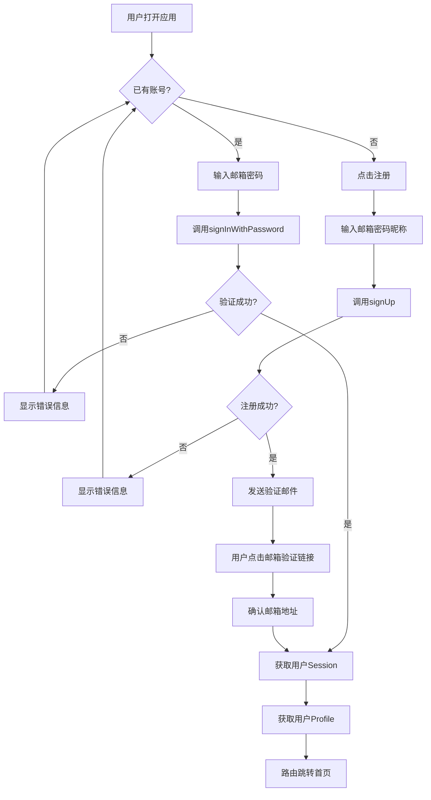

## 二、用户发帖流程

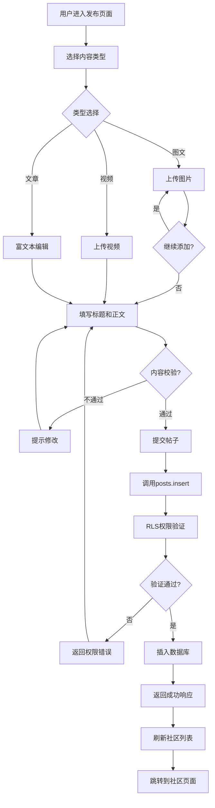

## 三、评论与回复流程

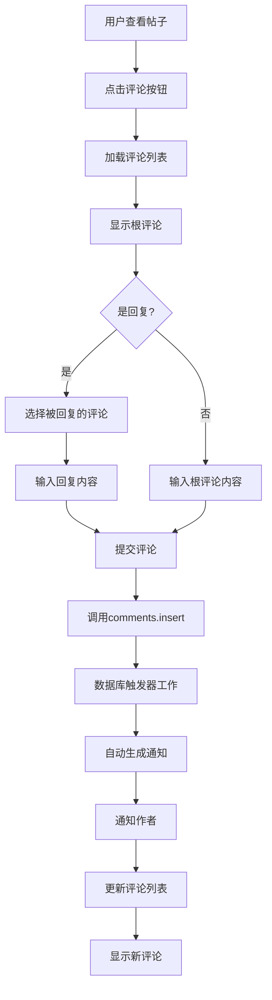

## 四、点赞收藏流程

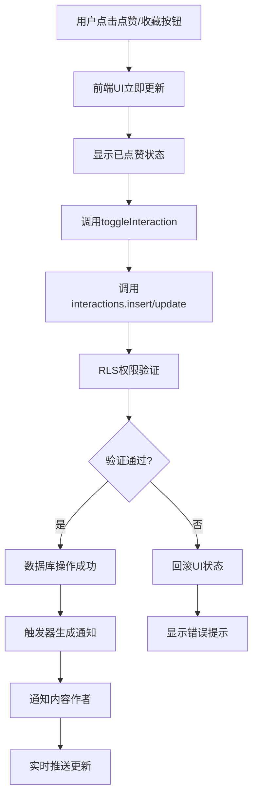

## 五、AI助手对话流程

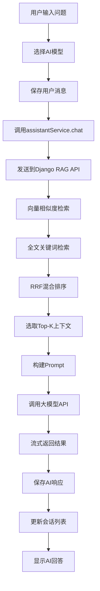

## 六、RAG检索增强流程

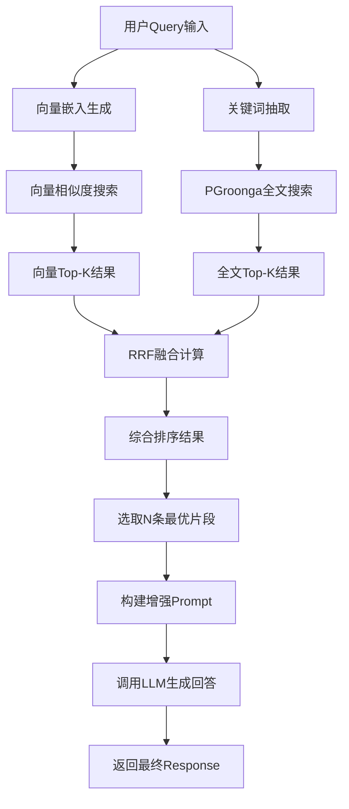

## 七、火车票查询流程

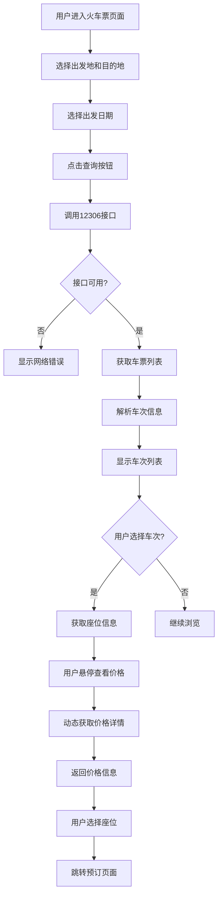

## 八、关注用户流程

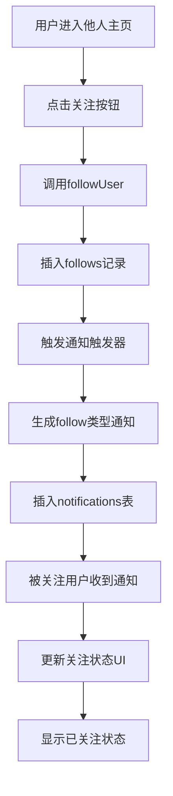

## 九、实时通知流程

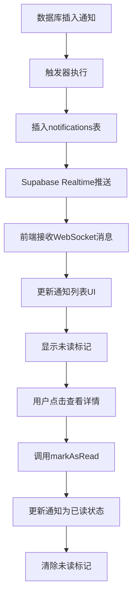

## 十、管理员后台流程

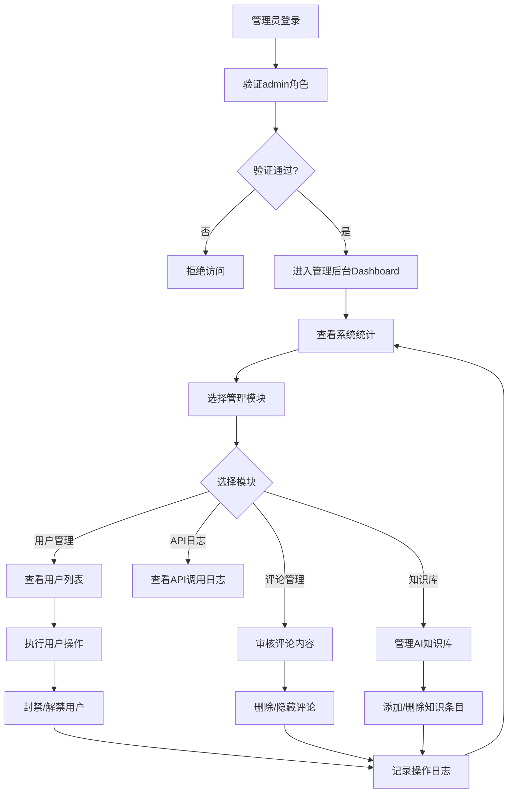

## 十一、前端路由守卫流程

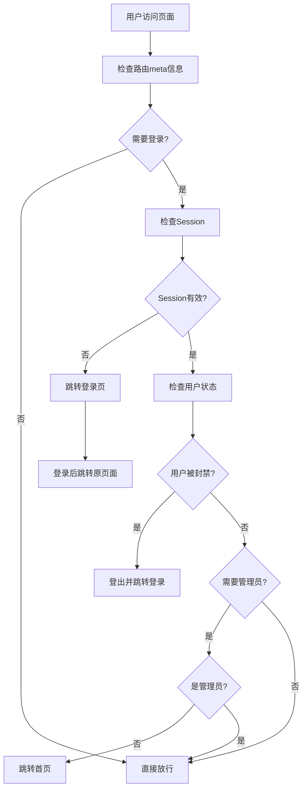

## 十二、文件上传流程

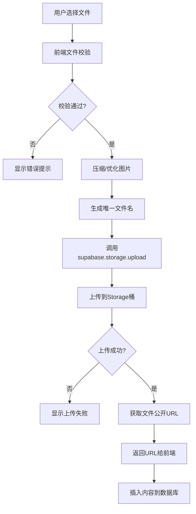

---

*文档生成时间：2026年3月*
*项目名称：基于Vue 3 + Supabase的云原生智慧旅游综合服务系统*
