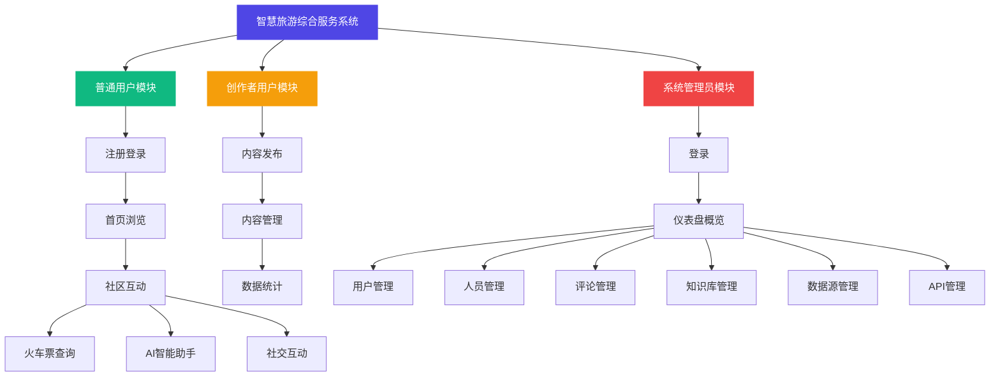

# 系统功能模块图

图 3-1 系统功能模块图

如图 3-1 所示，系统功能模块划分为三大类别。普通用户模块面向系统的主要服务对象，提供注册登录、首页浏览、社区互动、火车票查询、AI智能助手、社交互动六项核心功能。创作者用户模块面向社区内容贡献者，在普通用户功能基础上增加内容发布、内容管理、数据统计三项创作管理功能。系统管理员模块面向平台运营人员，提供登录、仪表盘概览、用户管理、人员管理、评论管理、知识库管理、数据源管理、API管理八项后台管理功能。
