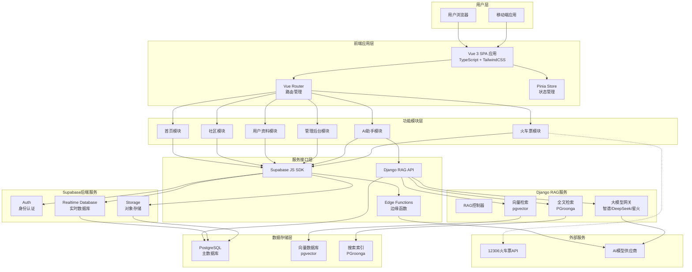
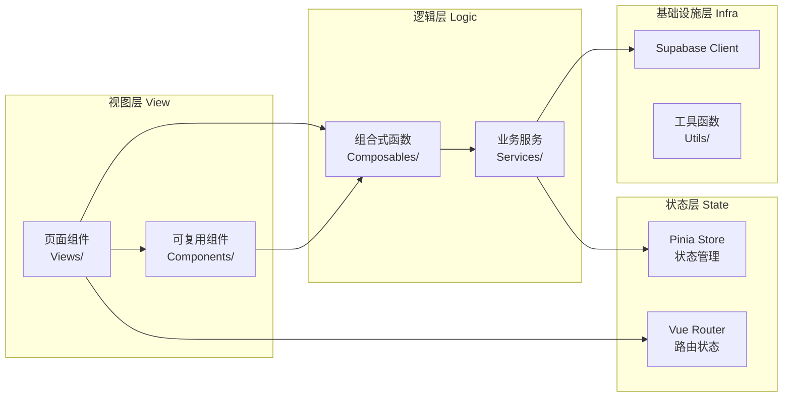
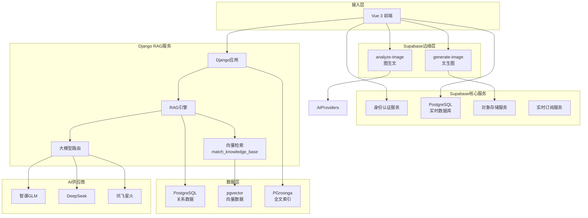
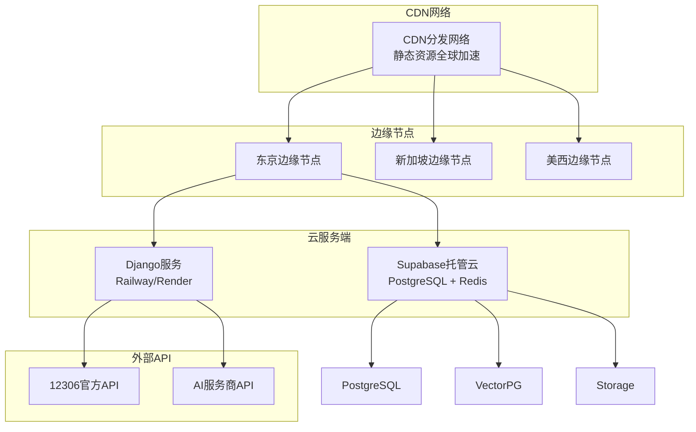

# 智慧旅游综合服务系统 架构图

## 一、系统总体架构

## 二、前端架构（Vue 3 SPA）

## 三、后端服务架构（Supabase BaaS + Django）

## 四、部署架构

## 五、技术选型说明

### 5.1 前端技术选型

| 技术 | 版本 | 用途 |
|------|------|------|
| Vue 3 | 3.3+ | 前端框架，响应式UI |
| TypeScript | 5.0+ | 类型安全开发 |
| Vite | 5.0+ | 构建工具，冷启动快 |
| TailwindCSS | 3.3+ | 原子化CSS |
| Vue Router | 4.0+ | 单页路由管理 |
| Pinia | 2.0+ | 状态管理 |
| supabase-js | 2.0+ | 后端服务客户端 |

### 5.2 后端技术选型

| 技术 | 用途 |
|------|------|
| Supabase | BaaS后端服务 |
| PostgreSQL | 主数据库 |
| pgvector | 向量嵌入存储 |
| PGroonga | 中文全文搜索 |
| Django | RAG应用框架 |
| Edge Functions | 无服务器计算 |

### 5.3 AI模型支持

| 模型 | 提供商 | 用途 |
|------|--------|------|
| GLM-4 | 智谱AI | 主力对话模型 |
| DeepSeek-chat | 深度求索 | 辅助对话模型 |
| Spark-4 | 讯飞星火 | 备用对话模型 |

## 六、系统特性

### 6.1 云原生特性

- **弹性伸缩**：Supabase托管服务自动扩缩容
- **全球加速**：CDN边缘节点分发静态资源
- **免运维**：BaaS模式无需管理服务器
- **高可用**：Supabase提供99.9% SLA保障

### 6.2 实时性特性

- **数据库实时订阅**：WebSocket推送数据变更
- **在线状态感知**：用户上线/下线实时显示
- **消息即时送达**：评论、点赞通知秒级推送

### 6.3 安全性特性

- **行级安全策略(RLS)**：数据访问精确控制
- **JWT认证**：安全的身份令牌
- **HTTPS加密**：全站SSL/TLS加密

---

*文档生成时间：2026年3月*
*项目名称：基于Vue 3 + Supabase的云原生智慧旅游综合服务系统*
